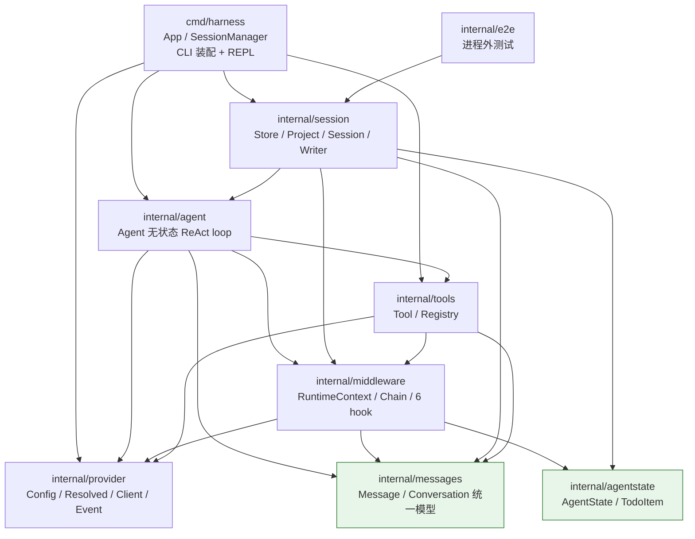
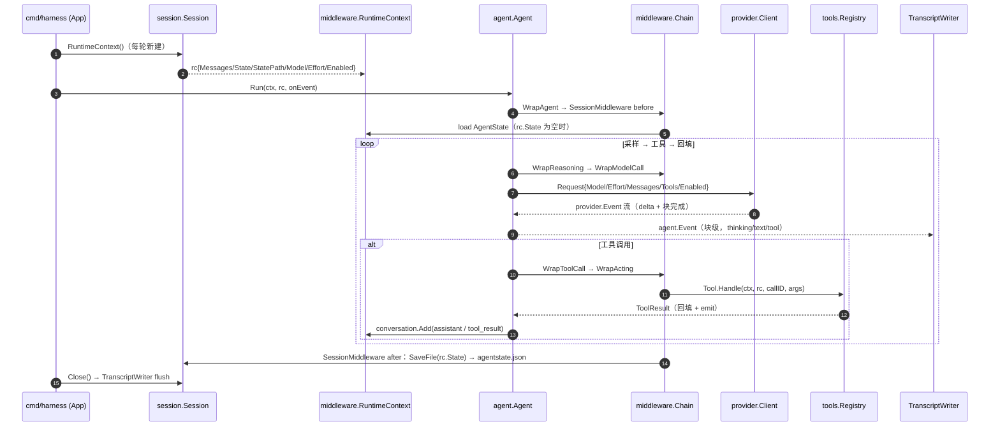
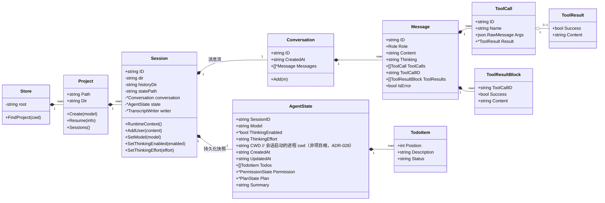
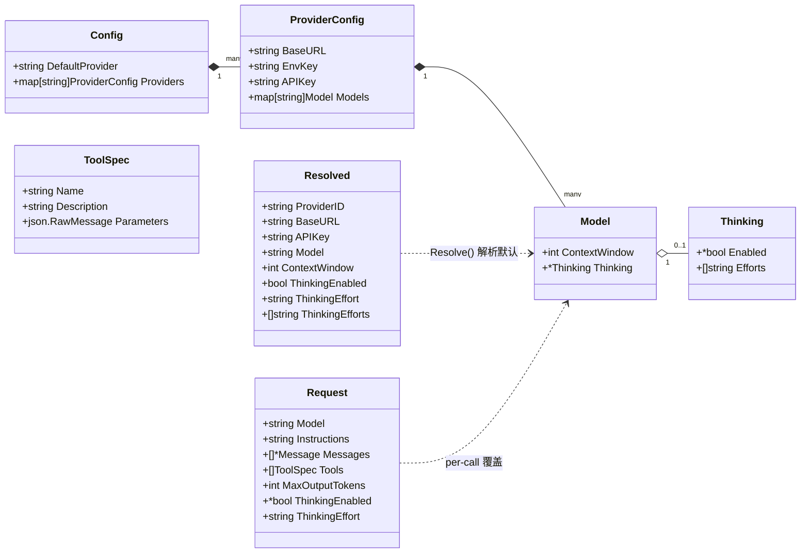
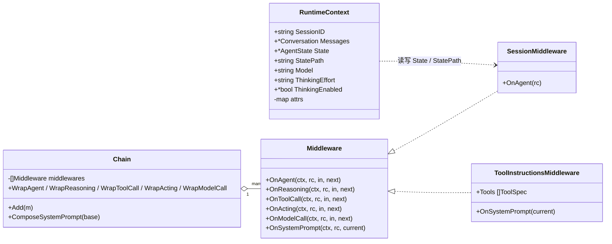
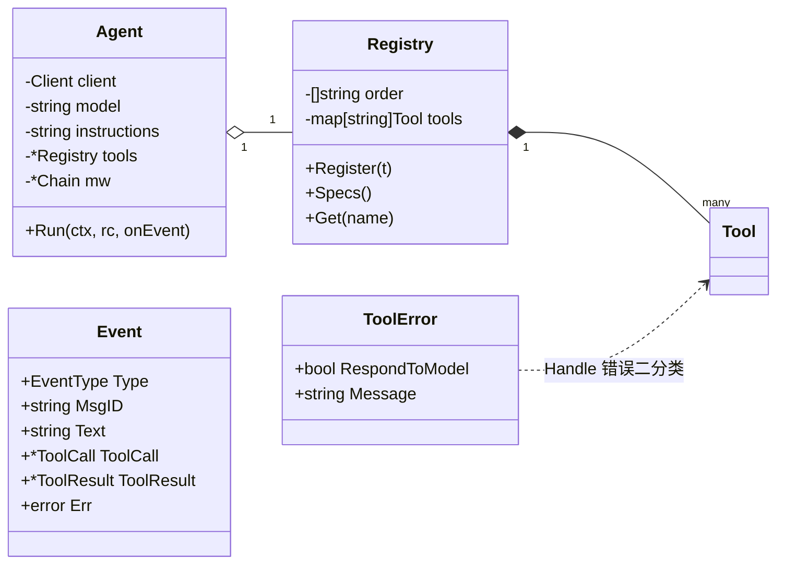
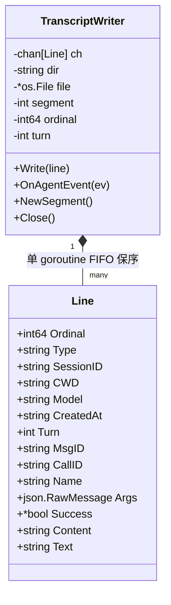
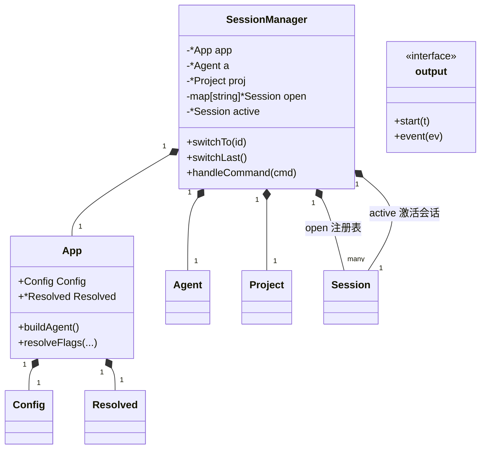

# 数据结构关系图

> 本项目所有核心数据结构的组织、关系与**设计机制**一览。用于快速理解"数据从哪来、在哪存、怎么流、为什么这样组织"。
> 配合 `CLAUDE.md`（架构约束）与 `docs/tasks/DECISIONS.md`（ADR）阅读。

## 一、包依赖分层



依赖约束（防环，ADR-025/026）：`agentstate` 独立成包，`middleware` 与 `session` 都只依赖它；`messages` 是叶子（核心层唯一操作模型）。

## 二、一次 `agent.Run` 的数据流



**要点**：agent 完全无状态（ADR-026）——每次 Run 传入独立 `rc`，`rc` 引用会话的 conversation/state；切换会话 = 换 active 再取新 `rc`，并行 = 每 goroutine 一个 `rc`。

## 三、核心设计机制（为什么这样组织）

> 数据结构清单是"是什么"，本节省略"为什么"。以下机制是全项目的骨架，理解它们比记字段更重要。

### 3.1 无状态 agent：一切经 rc（ADR-026 的骨架）

agent 是系统的"心脏"，但它**完全不持有会话状态**——`agent.Run(ctx, rc, onEvent)` 只认 rc，不碰 `Session`：

```
┌────────────────────────────────────────────┐
│ agent.Agent（无状态，一个进程共享一个）      │
│   Run(ctx, rc, onEvent)                    │
│     ├─ rc.Messages  → 读/追加消息          │
│     ├─ rc.Model / rc.Thinking* → Request   │
│     └─ 经 middleware 读写 rc.State         │
└────────────────────────────────────────────┘
                     ▲  每轮一个独立 rc
   ┌─────────────────┴─────────────────────┐
   │ Session.RuntimeContext() 生成 rc      │
   │  切换会话 = 换 active → 取新 rc       │
   │  并行    = 每 goroutine 各取一个 rc   │
   └───────────────────────────────────────┘
```

收益：
- **切换会话**：换 `active` 指针，下一轮取新 rc 即可——agent 核心零改动
- **并行 agent**（阶段五）：共享 agent + 共享 chain（全部中间件无状态），每 goroutine 一个 rc，零共享可变状态
- **可测**：agent 只依赖 rc（middleware 类型），测试用 FakeClient + 手填 rc，不碰磁盘

### 3.2 Session ↔ RuntimeContext：引用而非拷贝

`Session.RuntimeContext()` 不是复制数据，而是**新建 rc 并填入指向会话内部对象的指针**：

```go
rc.Messages == sess.conversation   // 同一个 *messages.Conversation
rc.State    == sess.state          // 同一个 *agentstate.AgentState
```

副作用是双向的：
- 工具 `Handle(ctx, rc, ...)` 里 `rc.State.Todos` 加 todo → 就是改会话的 state
- agent 里 `rc.Messages.Add(...)` → 就是往会话 conversation 加消息
- Run 结束后 `SessionMiddleware` 把 `rc.State` 存盘 → 会话持久化

| 维度 | Session | RuntimeContext |
|---|---|---|
| 生命周期 | 长：启动创建 → 退出 flush；或 resume 加载 | 短：每轮新建 → 该轮 Run 结束丢弃 |
| 拥有数据 | **是**（conversation / state / writer / statePath） | **否**（仅指针引用） |
| 持久化 | 管（transcript writer + agentstate.json） | 不管（经 SessionMiddleware 落盘） |
| 数量关系 | 1 个 Session | N 个 rc（每轮一个，用完即弃） |
| 所在包 | `internal/session` | `internal/middleware` |

**为什么这样设计**：
1. **无状态 agent**：agent 只认 rc，`Request` 从 rc 取模型/档位，核心循环无会话概念
2. **防环**：`session.go` 引 agent（事件类型）；若 agent 再引 Session 会成环。rc 是中间介质——session 生成 rc（依赖 middleware），agent 消费 rc（依赖 middleware），两者只经 rc 通信，互不依赖

> 类比：Session 是**房间**（长期存在，内放 conversation/state/writer）；rc 是**每次进门发的门禁卡**（写房间号 + 能碰哪些对象，每轮重发）。改卡片指向的东西 = 改房间里的真实物品。

### 3.3 三层会话结构 + SessionManager

workspace 的会话按三层组织（Store → Project → Session），职责逐层收窄：

| 层 | 类型 | 职责 |
|---|---|---|
| Store | `session.Store` | 全局目录布局（root 解析、项目桶定位 `FindProject`） |
| Project | `session.Project` | 某个项目下的会话集合（`Create` / `Resume` / `Sessions` / `Last`） |
| Session | `session.Session` | 单个会话本体（conversation + state + writer + statePath） |

CLI 侧另有一个**横切**的 `SessionManager`（cmd/harness），它不是第四层，而是 REPL 的"会话注册表 + 当前指针"：

```
SessionManager
 ├─ open   map[string]*Session   // 已开会话（进程内 resume 缓存，切回零成本）
 └─ active *Session              // 当前对话的会话（每轮取 RuntimeContext 起 rc）
```

**进程内切换** = 换 `active`：`/switch <id>`（未开 → `proj.Resume` 从磁盘重建入 `open`；已开 → 直接复用）。`/model`、`/effort` 也只改 `active` 的 state 并落盘。三个命令全部不触碰 agent 核心。

### 3.4 Request 的粒度：一次 model call

`provider.Request` 的粒度是**一次模型调用（model call）**，不是一次 agent run：

```
agent.Run（一个回合）
 └─ for 循环（每遇工具调用就再采一轮，直到模型不再请求工具）
     └─ 每轮 = 1 个 provider.Request
         └─ client.Stream(req) = 1 次 HTTP 请求
```

- `AgentInput`（onAgent）↔ 一整个 `agent.Run`
- `ModelCallInput`（onModelCall）↔ 1 个 `Request`（`sample()` 从 ModelCallInput 构建）

因此 `Request.Model/ThinkingEnabled/ThinkingEffort` 是"**这一次调用**用哪个模型、什么档位"（ADR-026 per-call 覆盖，三态：nil/空 = client 默认）。同一回合内不同轮理论上可不同（实际会话里每轮从 rc 取，通常一致）。

### 3.5 App（进程级）vs RuntimeContext（调用级）

两个带"运行时"意味但概念完全不同的对象：

| 维度 | `cmd.App` | `middleware.RuntimeContext` |
|---|---|---|
| 作用域 | **进程级**：一次进程一份 | **调用级**：每次 Run 一份 |
| 内容 | 配置（Config）+ 默认模型（Resolved） | 会话引用 + per-call 覆盖 |
| 用途 | buildAgent / resolveFlags | 承载会话上下文，供 agent / middleware / 工具 |
| 生命周期 | 惰性单例（defaultApp，进程存活期） | 每轮新建，Run 结束丢弃 |
| 所在包 | cmd/harness | middleware（被 agent / session / tools 依赖） |

### 3.6 middleware hook 粒度：onAgent / onReasoning / onModelCall（包住什么）

三个最易混淆的 hook，区别只在**包裹的粒度**（洋葱从外到内）：

| hook | 包裹的粒度 | 代码边界 | 例子里的边界 |
|---|---|---|---|
| `onAgent` | 一整个回合 | `Run` 的 wrapped 全部 | 轮 1 前 → 最后一轮后（含所有采样 + 工具执行） |
| `onReasoning` | **一次采样轮** | `WrapReasoning(sample)`，即 `sample()` 全部 | 每轮：组装请求 → assistant 组装完 |
| `onModelCall` | **一次 HTTP 请求** | `client.Stream(req)` | 请求发出 → 流解码完 |

嵌套关系（一次回合可含多次采样轮，每轮恰一次请求，故 onReasoning 与 onModelCall 目前 1:1）：

```
agent.Run（一个回合）
 └─ onAgent 包裹整个回合
     └─ for 循环（每遇工具调用就再采一轮）
         └─ reasoning = WrapReasoning(sample)      ← onReasoning，包住一轮 sample
             └─ sample() 内部：
                 wrapped = WrapModelCall(Stream)    ← onModelCall，包住一次请求
                     ├─ 组装 provider.Request（per-call 覆盖在此）
                     ├─ client.Stream(req)          ← 实际 HTTP 请求
                     └─ 消费事件流 → 组装 assistant + toolCalls
```

**think / tool / 普通文本三种内容块**都是同一轮里从流中解码出的并列输出（`agent.go` 流循环三个 case：thinking_delta→tb、text_delta→sb、tool_call→calls），**全部在 onReasoning 包裹之内**，它不单独对应其中任何一种；三种块都在 `onModelCall` 的流解码处产出。

**判断准则**：
- 想做"这一轮开始前准备/注入什么"或"这一轮结束后收尾什么" → `onReasoning`（比模型调用高一层的边界，能看到输入组装与一轮结果）
- 想做"这次请求本身怎么发"（参数覆盖/日志/mock/重试） → `onModelCall`（最内层，能看到完整 Request）

**挂载映射**（ADR-021/027）：`onReasoning` = 压缩（阶段四）+ TodoReminder（todo 偏离提醒）；`onModelCall` = per-call 参数覆盖（Request.Model/Effort/ThinkingEnabled）。

**反例**：TodoReminder 为何挂 onReasoning 而非 onModelCall？因为要在"一轮思考开始前"判断是否往消息列表尾部注入提醒——属于采样轮的输入组装，不是请求参数。

### 3.7 提醒注入的请求级机制：为什么不落盘（ADR-027）

TodoReminder 触发时把提醒塞进**请求消息尾部**，但刻意不写 conversation / 不落 transcript：

```go
// todo_reminder.go（触发时）
msgs := make([]*messages.Message, len(in.Messages), len(in.Messages)+1)
copy(msgs, in.Messages)
msgs = append(msgs, &messages.Message{...提醒 user 消息})
in.Messages = msgs   // 只影响本次请求，conversation 原封不动
```

**为什么必须 copy 而非直接 append**（Go 切片共享底层数组）：`in.Messages` 与 `conversation.Messages` 共享同一底层数组——建立点在 `agent.go` 传参 `ReasoningInput{Messages: conversation.Messages}`（切片传值只复制 24 字节描述符 {ptr, len, cap}，数组只有一份）。直接 `append` 若容量够，会写穿到底层数组，等于往会话历史偷塞一条消息。copy 出新切片是隔离层。

**为什么不落盘**：
1. **resume 不重放**：提醒是一次性注意力拉回，落盘后 resume 会带着历史里所有过时提醒重放（噪音）
2. **审计干净**：transcript 是人读的对话记录，提醒是 harness 内部干预，不属于用户对话
3. **前缀缓存稳定**：conversation 是缓存（Anthropic auto-caching / DeepSeek context caching 前缀匹配）的命脉，提醒不进去 → 历史完全由真实对话决定，逐轮追加稳定可缓存

提醒的计数状态（todo_last_activity）在 rc.attrs，per-Run 内存态随 rc 新建清零；跨 Run 持久的是 todo 列表本体（AgentState → agentstate.json），与 transcript 轨互不干扰（双轨持久化，ADR-025）。

### 3.8 用户中断的回合级机制：cancel runCtx + AddUser 落盘（ADR-028）

REPL 改**单一读方事件循环**：goroutine 逐 rune 读 stdin（raw mode）→ channel 分发；主循环 `select` 输入事件 / 回合完成。Esc(0x1b)/Ctrl+C(0x03) → esc 事件 → `cancel()` **当前回合的 runCtx**：

```
readStdinEvents (goroutine, raw mode)
 ├─ 0x1b / 0x03 → esc 事件 → 主循环 cancel() 本轮 runCtx
 ├─ \r\n       → line 事件 → 提交用户消息 / REPL 命令
 ├─ 退格        → 删行尾 + 回显 "\b \b"
 └─ 其它 rune   → 追加行 + 回显（ReadRune 支持中文）
main select:
 ├─ ev.line  → AddUser + goroutine 跑 agent.Run（每轮独立 runCtx）
 └─ runDone  → 返回 context.Canceled → "（已中断本轮）" + AddUser("（系统：上一轮被中断…）")
```

**为什么每轮独立 runCtx**：信号 `signal.NotifyContext` 的 ctx 一旦 cancel 永久失效，下一轮 Run 立即失败；每轮 `context.WithCancel` 新建 → 中断只停本轮，下一轮正常。**中断提示 AddUser 落盘**：写 conversation + transcript，resume 后模型看到"上一轮被中断"，对齐 Claude Code resume 行为（与 TodoReminder 的不落盘临时注入相反——中断是持久事件，值得落盘）。

runCmd（单轮）用 `withEscInterrupt`（MakeRaw + goroutine 监听 Esc/Ctrl+C → cancel；非 TTY 跳过监听正常跑）。

## 四、核心数据结构

### 4.1 会话与消息（messages / agentstate / session）



**双轨持久化**（ADR-025）：消息流 → `transcript`（块级 Line，见 4.5）；非消息状态（模型/档位/todo/权限/plan/摘要）→ `AgentState`（`agentstate.json`，每次 Run 进出各存一次）。

### 4.2 配置与请求（provider）



**配置链路**：`provider.LoadConfig` → `Config` → `Resolve` → `Resolved`（默认模型，`App.Resolved` 缓存）→ `NewClient`。per-call 覆盖（ADR-026）：`Request.Model/ThinkingEnabled/ThinkingEffort`，`nil/空 = 继承 client 默认`。

### 4.3 运行时上下文与中间件（middleware）



**注**：`RuntimeContext` 是 per-call 上下文（每 Run 新建），`Chain` 及其中间件全部无状态 → 共享 chain 可被多 goroutine 并发 Run。

### 4.4 agent 与工具（agent / tools）



**工具错误二分类**（ADR-003）：`RespondToModel=true` → 结果回填、循环继续；`false`（Fatal）→ 终止回合。

**update_todo 工具**（ADR-027）：全量替换当前会话待办清单（`{todos:[{position, description, status}]}`，模型显式填 position 维护顺序），经 `rc.State.Todos` 读写（`AgentState.ReplaceTodos` 按 position 稳定排序；`RenderTodos` 渲染为 markdown 有序列表 `1. [~] …`），随 SessionMiddleware after 无条件落盘 agentstate.json（resume 恢复）。**TodoReminderMiddleware**（onReasoning）：每轮采样计数存 rc.attrs（per-Run），todo 非空且模型连续 ≥10 次 model call 未更新 → 在**请求消息尾部**注入提醒（注入临时副本，不写 conversation → 不落盘/不重放）。模型可见性 = 工具结果回填（基础）+ 提醒（防偏离兜底）。

**ToolOutputMiddleware**（ADR-028）：挂 onToolCall，after 阶段统一改写本批 tool_result 消息的 Content。工具返回完整结果（职责纯，工具内不截断）；超 `MaxOutputChars`(20K) → **head 前 50% + tail 后 50%**（各 10K）+ 中间省略计数 + 全量落盘 `<会话>/evictions/tool_<ts>.txt` + 绝对路径 + "read_file/grep 读取"提示。`EvictContent`（导出，shell 超时错误分支也用它）。rc/StatePath 空退化纯截断。**transcript 记完整**（审计全量），conversation 记 preview+路径（resume 重建后模型可见全量历史）。

### 4.5 落盘格式

#### workspace 目录树（`$HARNESS_HOME || ~/.harness`）

```
~/.harness/
├── config.yaml                # 全局配置（provider.LoadConfig 查找）
├── agents.md                  # 全局 persona（阶段四注入）
├── workspaces/
│   └── <项目转义>/            # D:\a\b → D__a_b（保留盘符）
│       └── <session-id>/      # 目录名即会话 id（时间戳-8hex）
│           ├── historys/history-<n>.jsonl   # 块级 transcript
│           ├── agentstate.json              # AgentState 快照（JSON 整体重写）
│           ├── evictions/                   # 超长工具结果落盘（ADR-028）
│           └── plans/                        # 计划文件（预留）
```

#### transcript 行（Line）—— 块级事件，每块一行



`Line.Type` 取值：`meta | user | thinking | text | tool_use | tool_result | turn_start | turn_end`。`MsgID` 关联 thinking/text/tool_use 归属的 assistant 消息。

#### 并发工具结果的存储：transcript 逐行 vs conversation 合并（ADR-024/025）

一次采样模型发出多个 tool_call（并发执行，ADR-024）时，两个存储层面形态不同：

```jsonl
{"ordinal":4,"type":"tool_use",   "msg_id":"msg_x","call_id":"call_A","name":"list_dir",      "args":{"path":"."}}
{"ordinal":5,"type":"tool_use",   "msg_id":"msg_x","call_id":"call_B","name":"shell_command",  "args":{"command":"..."}}
{"ordinal":6,"type":"tool_result","turn":1,"call_id":"call_A","success":true,"content":"dir\t.git\nfile\t..."}   ← 独立一行
{"ordinal":7,"type":"tool_result","turn":1,"call_id":"call_B","success":true,"content":"parallel-ok\r\n"}       ← 独立一行
```

| 存储 | 并发工具结果形态 | 原因 |
|---|---|---|
| **transcript（jsonl，磁盘）** | **每个工具结果一行** `tool_result`（各带 call_id），不合并 | transcript 是**块级事件流**：writer 对每个 `EventToolResult` 写一行（`transcript.go` OnAgentEvent），忠实记录事件粒度，审计/压缩可见真实块级历史 |
| **conversation（内存，模型输入）** | **一条 `RoleTool` 消息带多块**（`ToolResults: [call_A块, call_B块]`） | agent.go `runToolBatch` 并发执行 → 按 calls 顺序组装 blocks → `NewToolResultsMessage` 合并 Add（满足 anthropic 紧邻要求：tool_use 后下一条含全部 tool_result） |

**resume 合并**：`LoadConversation` 逐行重建时，`appendToolResult` 检测上一条已是 `RoleTool` → 把下一行 tool_result **append 到同一消息**（`transcript.go:255-263`），内存恢复成一条多块消息。正常 ReAct 循环里一批并行结果的 tool_result 行连续写入，故总能正确合并；若中间夹了其它消息则不合并（各自成块）。

**顺序保证**：并发执行结果先入 `results map[callID]`，回填按 `in.Calls` 原始顺序遍历组装——模型看到的块顺序 = 它发出调用的顺序，不因并发完成快慢错乱。ToolOutputMiddleware 逐块独立截断/豁免（read_file 豁免，ADR-028），同一批里 shell 截断 + read 完整互不影响。

**resume 语义**：只读最大序号文件（`history-<n>.jsonl`），按 ordinal 逐行重建 conversation（thinking 入 `Message.Thinking`，tool_result 合并）；`agentstate.json` 恢复非消息状态（含模型/档位）。

## 五、CLI 层（cmd/harness）



**REPL 运行时切换**：`/switch <id>|--last`（换 `active`，未开则 Resume 入注册表）、`/model <name>`、`/effort <level>`（都落 `AgentState` 立即持久化）。

## 六、关键关系速查

| 关系 | 说明 |
|---|---|
| `Agent.Run` ↔ `rc` | agent 无状态，每次 Run 一个独立 rc；rc 引用会话的 conversation/state（`Session.RuntimeContext()` 每轮新建） |
| `rc` ↔ `SessionMiddleware` | 无状态中间件从 `rc.StatePath` 读 load / 写 save（共享 chain 可并发） |
| `Request` ↔ `Model/Thinking` | per-call 覆盖：`Request.Model/ThinkingEnabled/ThinkingEffort`，三态（nil/空 = client 默认） |
| `Message.Thinking` | 存审计但不重放（provider 重放 assistant 时剥离；thinking-only 空消息跳过） |
| `transcript` ↔ `AgentState` | 双轨：消息流（块级 Line） vs 非消息状态（JSON 快照），resume 两者重建 |
| `update_todo` ↔ `rc.State.Todos` | todo 全量替换挂 AgentState（ReplaceTodos/RenderTodos），SessionMiddleware after 落盘；TodoReminder 防偏离（ADR-027） |
| `ToolOutputMiddleware` ↔ tool_result | onToolCall after 统一截断（>20K → head/tail + evictions/ 落盘 + 路径），transcript 记完整、conversation 记 preview（ADR-028） |
| REPL 中断 ↔ runCtx | Esc/Ctrl+C（raw mode 事件循环）→ cancel 本轮 runCtx → AddUser 系统提示落盘，resume 可见（ADR-028） |
| `App` ↔ `Config/Resolved` | 配置统一入口：惰性单例缓存默认模型，`--config` 显式路径单独加载 |
| `Conversation` ↔ `Message` ↔ `ToolResult` | 一条 tool_result 消息可合并多块（满足 anthropic 紧邻要求，ADR-024） |
