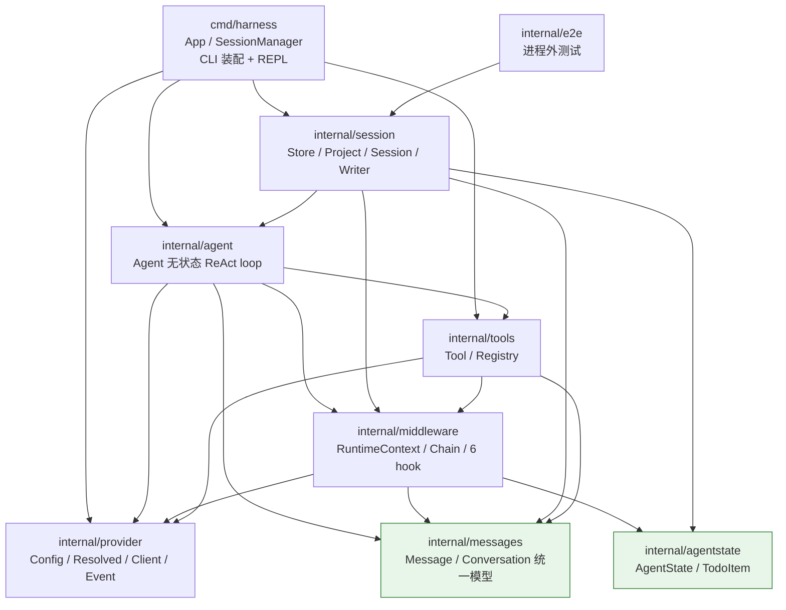
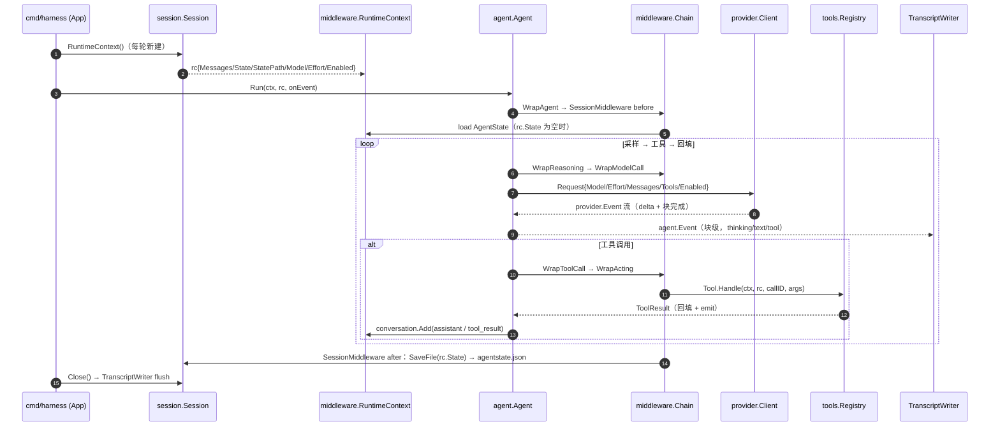
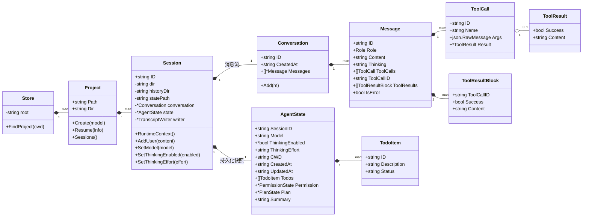
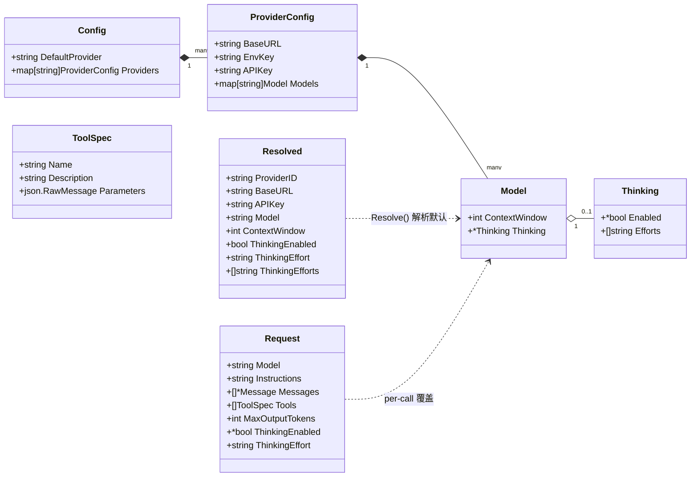
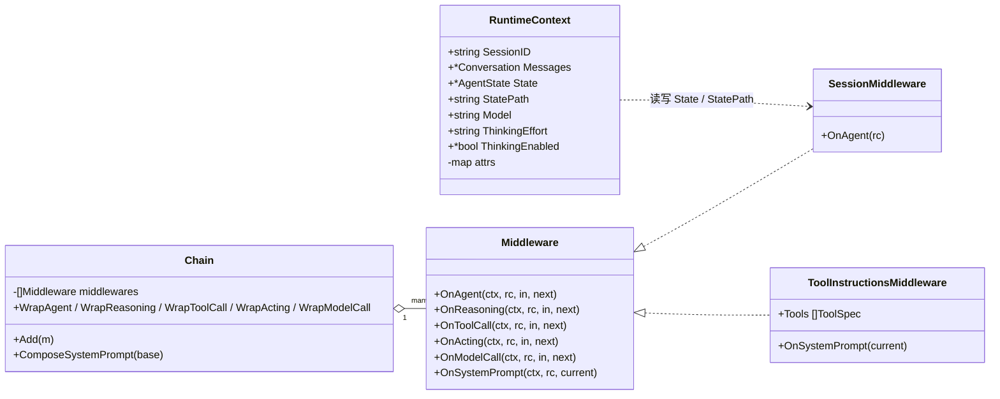
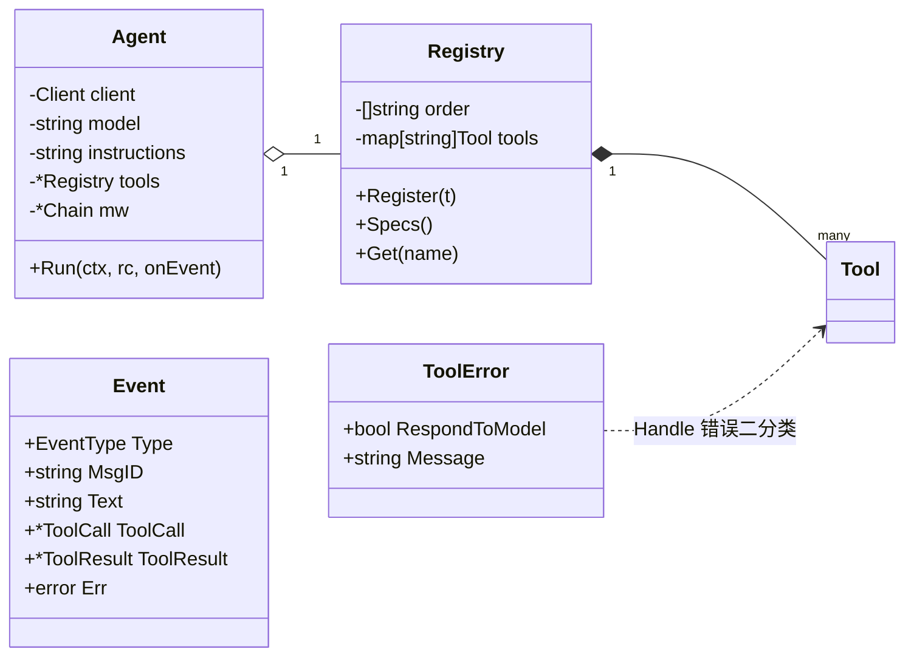
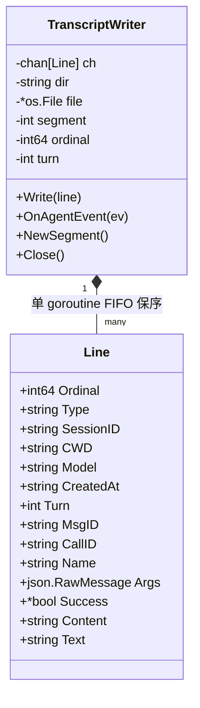
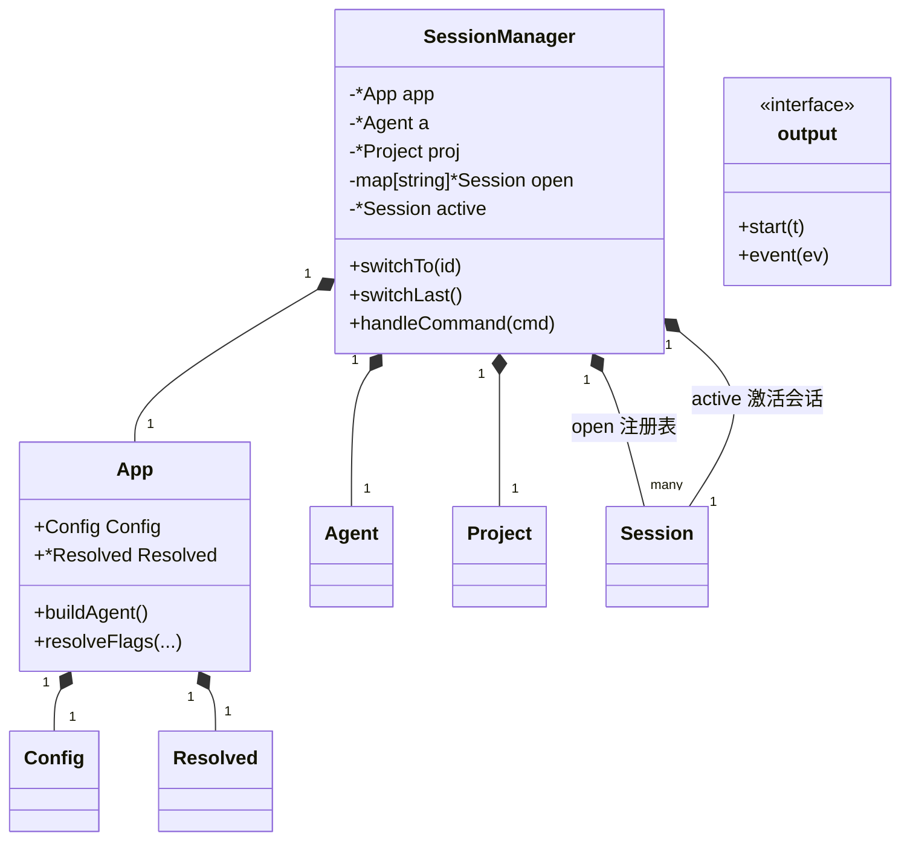

# 数据结构关系图

> 本项目所有核心数据结构的组织与关系一览。用于快速理解"数据从哪来、在哪存、怎么流"。
> 配合 `CLAUDE.md`（架构约束）与 `docs/tasks/DECISIONS.md`（ADR）阅读。

## 一、包依赖分层



依赖约束（防环，ADR-025/026）：`agentstate` 独立成包，`middleware` 与 `session` 都只依赖它；`messages` 是叶子（核心层唯一操作模型）。

## 二、一次 `agent.Run` 的数据流



**要点**：agent 完全无状态（ADR-026）——每次 Run 传入独立 `rc`，`rc` 引用会话的 conversation/state；切换会话 = 换 active 再取新 `rc`，并行 = 每 goroutine 一个 `rc`。

## 三、核心数据结构

### 3.1 会话与消息（messages / agentstate / session）



**双轨持久化**（ADR-025）：消息流 → `transcript`（块级 Line，见 3.5）；非消息状态（模型/档位/todo/权限/plan/摘要）→ `AgentState`（`agentstate.json`，每次 Run 进出各存一次）。

### 3.2 配置与请求（provider）



**配置链路**：`provider.LoadConfig` → `Config` → `Resolve` → `Resolved`（默认模型，`App.Resolved` 缓存）→ `NewClient`。per-call 覆盖（ADR-026）：`Request.Model/ThinkingEnabled/ThinkingEffort`，`nil/空 = 继承 client 默认`。

### 3.3 运行时上下文与中间件（middleware）



**注**：`RuntimeContext` 是 per-call 上下文（每 Run 新建），`Chain` 及其中间件全部无状态 → 共享 chain 可被多 goroutine 并发 Run。

### 3.4 agent 与工具（agent / tools）



**工具错误二分类**（ADR-003）：`RespondToModel=true` → 结果回填、循环继续；`false`（Fatal）→ 终止回合。

### 3.5 落盘格式

#### workspace 目录树（`$HARNESS_HOME || ~/.harness`）

```
~/.harness/
├── config.yaml                # 全局配置（provider.LoadConfig 查找）
├── agents.md                  # 全局 persona（阶段四注入）
├── workspaces/
│   └── <项目转义>/            # D:\a\b → D__a_b（保留盘符）
│       └── <session-id>/      # 目录名即会话 id（时间戳-8hex）
│           ├── historys/history-<n>.jsonl   # 块级 transcript
│           ├── agentstate.json              # AgentState 快照（JSON 整体重写）
│           └── plans/                        # 计划文件（预留）
```

#### transcript 行（Line）—— 块级事件，每块一行



`Line.Type` 取值：`meta | user | thinking | text | tool_use | tool_result | turn_start | turn_end`。`MsgID` 关联 thinking/text/tool_use 归属的 assistant 消息。

**resume 语义**：只读最大序号文件（`history-<n>.jsonl`），按 ordinal 逐行重建 conversation（thinking 入 `Message.Thinking`，tool_result 合并）；`agentstate.json` 恢复非消息状态（含模型/档位）。

## 四、CLI 层（cmd/harness）



**REPL 运行时切换**：`/switch <id>|--last`（换 `active`，未开则 Resume 入注册表）、`/model <name>`、`/effort <level>`（都落 `AgentState` 立即持久化）。

## 五、关键关系速查

| 关系 | 说明 |
|---|---|
| `Agent.Run` ↔ `rc` | agent 无状态，每次 Run 一个独立 rc；rc 引用会话的 conversation/state（`Session.RuntimeContext()` 每轮新建） |
| `rc` ↔ `SessionMiddleware` | 无状态中间件从 `rc.StatePath` 读 load / 写 save（共享 chain 可并发） |
| `Request` ↔ `Model/Thinking` | per-call 覆盖：`Request.Model/ThinkingEnabled/ThinkingEffort`，三态（nil/空 = client 默认） |
| `Message.Thinking` | 存审计但不重放（provider 重放 assistant 时剥离；thinking-only 空消息跳过） |
| `transcript` ↔ `AgentState` | 双轨：消息流（块级 Line） vs 非消息状态（JSON 快照），resume 两者重建 |
| `App` ↔ `Config/Resolved` | 配置统一入口：惰性单例缓存默认模型，`--config` 显式路径单独加载 |
| `Conversation` ↔ `Message` ↔ `ToolResult` | 一条 tool_result 消息可合并多块（满足 anthropic 紧邻要求，ADR-024） |
